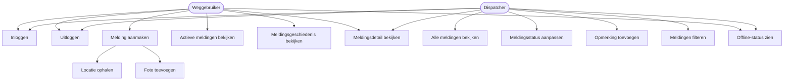
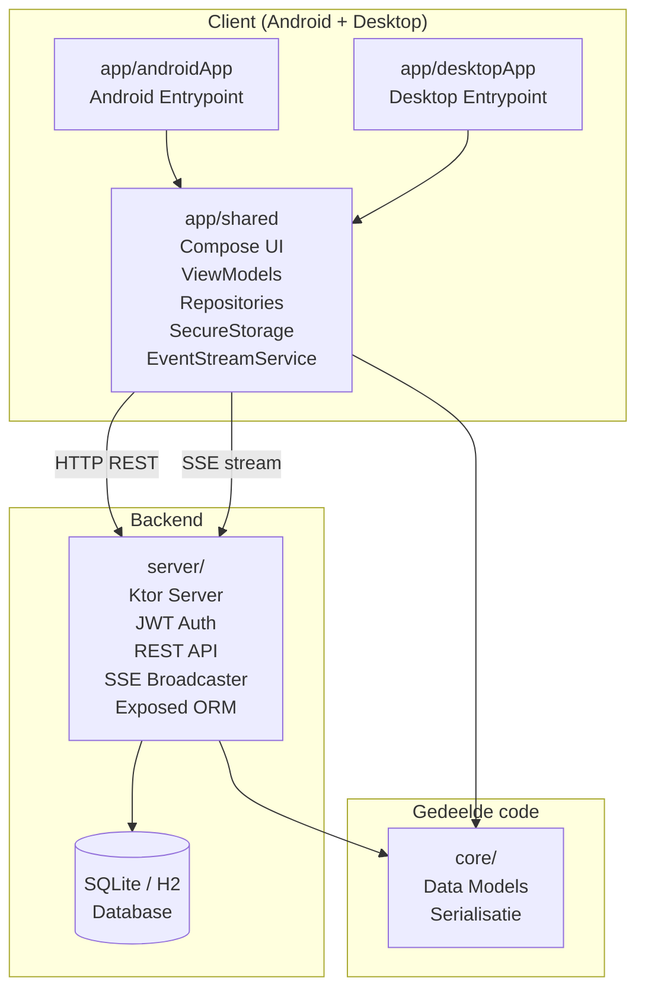
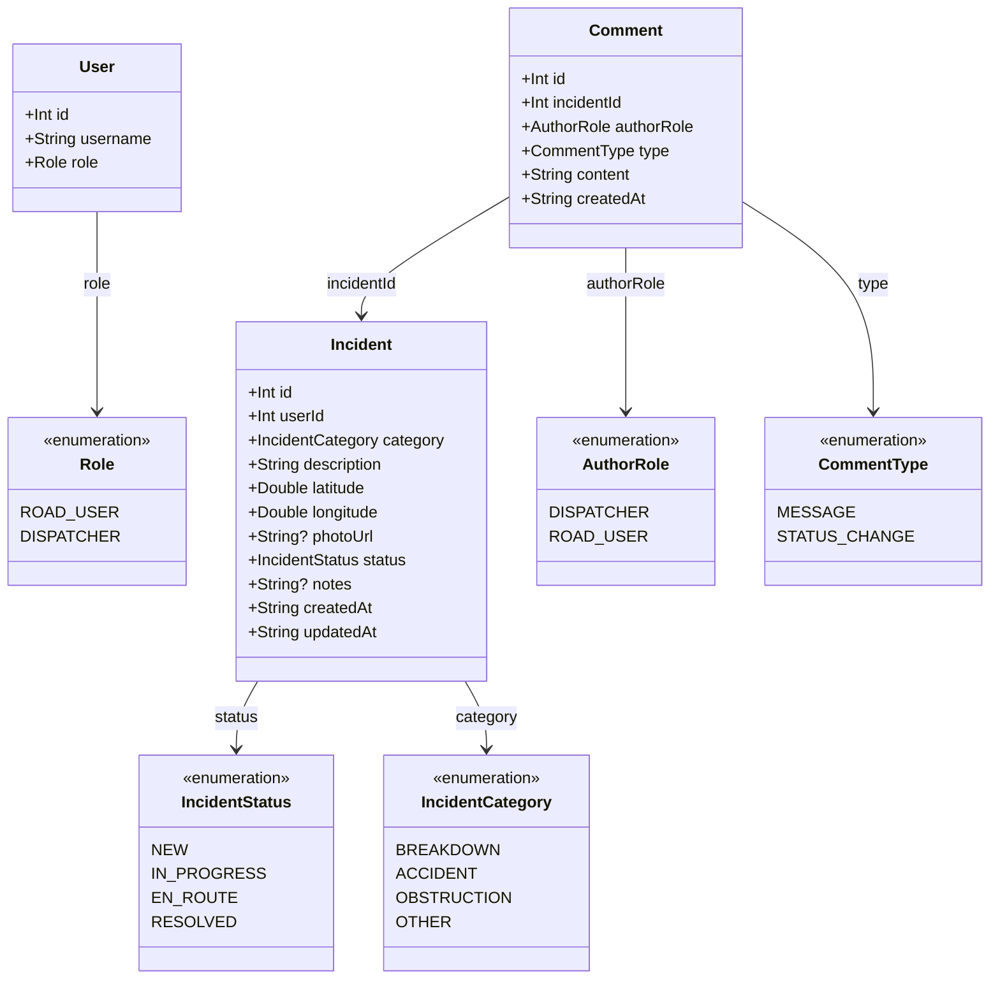
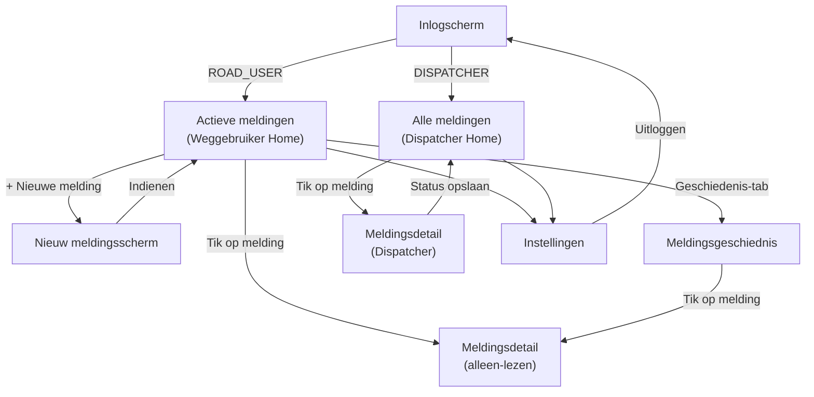

# Ontwerpdocument — RoadAssist

**Opleiding:** Avans Deeltijd Informatica
**Module:** AVD Full stack development met .NET (vervangingsopdracht — goedgekeurd door docent)
**Versie:** 1.0
**Datum:** 2026-06-19

---

## Inhoudsopgave

1. Inleiding
2. Situatieschets
3. Probleemstelling
4. Doelstelling
5. Scope
6. Gebruikers en rollen
7. Functionele eisen
8. Niet-functionele eisen
9. Softwarearchitectuur
10. UML-diagrammen
11. Subsystemen
12. Testplan
13. Datamodellen
14. Backend API
15. Schermen en navigatie
16. Gebruikersstromen

---

## 1. Inleiding

Voor de module AVD Full stack development met .NET wordt normaal gesproken een opdracht uitgewerkt in .NET MAUI. Na overleg met de docent is goedkeuring gevraagd om in plaats daarvan een vergelijkbaar project te bouwen in Kotlin Multiplatform (KMP) met Compose Multiplatform. Deze casus is opgesteld als voorstel voor die vervangende opdracht.

De app die gebouwd wordt heet RoadAssist: een pechhulp- en incidentenmeldingsapp, vergelijkbaar met hoe organisaties zoals de ANWB of andere wegenhulpdiensten hun meldingen ontvangen en opvolgen. Weggebruikers kunnen een incident melden, en een dispatcher aan de andere kant volgt de binnenkomende meldingen op en werkt de status bij. De app werkt op Android en desktop (Windows en Linux).

## 2. Situatieschets

Stel je voor: je rijdt op de snelweg en je band springt lek. Je staat aan de kant van de weg en wil zo snel mogelijk hulp inroepen. Je wil iemand laten weten waar je precies bent, wat er aan de hand is, en je wil weten wanneer er iemand onderweg is.

Aan de andere kant zit een medewerker van de wegenhulpdienst. Die ziet alle inkomende meldingen en werkt de status bij. Op dit moment verloopt veel van deze communicatie via telefoon, wat traag is en foutgevoelig.

Een app die dit proces ondersteunt, zou de situatie voor beide kanten eenvoudiger maken: de weggebruiker stuurt een melding met zijn locatie en een foto, en de dispatcher ziet alles overzichtelijk in een lijst.

## 3. Probleemstelling

**Probleemstelling:** Hoe kan een app die werkt op zowel Android als desktop, weggebruikers in nood helpen om snel en duidelijk een melding te maken, en tegelijkertijd de dispatcher een overzichtelijk beeld geven van alle inkomende meldingen en hun status?

## 4. Doelstelling

Het doel is het bouwen van RoadAssist met twee gebruikersrollen die samenwerken via een gedeelde backend:

- Een weggebruiker kan een incident melden met een beschrijving, zijn huidige locatie en optioneel een foto.
- Een weggebruiker kan de status van zijn actieve melding volgen en zijn volledige meldingsgeschiedenis raadplegen.
- Een dispatcher kan alle inkomende meldingen zien, details bekijken en de status van een melding bijwerken.
- Beide rollen loggen in via hetzelfde inlogscherm; de app toont daarna de juiste weergave op basis van de rol.
- De app werkt op Android en desktop (Windows en Linux). Een webversie is een optionele uitbreiding.

## 5. Scope

### 5.1 Wat hoort erbij

- De app werkt op Android en desktop (Windows en Linux).
- Gebruikers kunnen inloggen; de app toont een andere weergave afhankelijk van de rol.
- Een weggebruiker kan een nieuwe melding aanmaken met een beschrijving, categorie, locatie en optioneel een foto.
- De huidige locatie van de gebruiker wordt automatisch opgehaald bij het aanmaken van een melding.
- Een weggebruiker ziet een overzicht van zijn actieve meldingen en heeft een apart scherm met zijn volledige meldingsgeschiedenis.
- Een dispatcher ziet een overzicht van alle meldingen en kan de status aanpassen (bvb. "In behandeling", "Onderweg", "Afgehandeld").
- Beide rollen kunnen de details van een melding bekijken, inclusief de foto en locatie.
- De app toont een melding als er geen verbinding is met de server.

### 5.2 Optionele uitbreidingen

- Pushmeldingen wanneer de status van een melding verandert.
- Een kaartweergave van de locatie bij een melding.
- Meerdere dispatcher-rollen met verschillende rechten (bvb. regiobeheerder).
- Biometrische beveiliging bij het inloggen (vingerafdruk of gezichtsherkenning).
- Een webversie van de app.

### 5.3 Wat hoort er niet bij

- Realtime communicatie tussen weggebruiker en dispatcher (zoals een chat).
- Automatische toewijzing van hulpverleners.
- Integratie met externe kaart- of navigatiediensten.
- Betalingen of abonnementen.

## 6. Gebruikers en rollen

| Rol | Omschrijving |
|-----|--------------|
| Weggebruiker | Een persoon die pech heeft of een incident wil melden. Kan alleen zijn eigen meldingen zien. |
| Dispatcher | Een medewerker van de wegenhulpdienst die inkomende meldingen opvolgt. Kan alle meldingen zien en de status aanpassen. |

## 7. Functionele eisen

| ID | Rol | Omschrijving | Prioriteit |
|----|-----|--------------|------------|
| FR-01 | Beide | De gebruiker kan inloggen met een gebruikersnaam en wachtwoord. | Must |
| FR-02 | Beide | Na het inloggen ziet de gebruiker de weergave die bij zijn rol hoort. | Must |
| FR-03 | Weggebruiker | De gebruiker kan een nieuwe melding aanmaken met een beschrijving en categorie (bvb. pech, ongeluk, wegversperring). | Must |
| FR-04 | Weggebruiker | Bij het aanmaken van een melding wordt de huidige locatie automatisch opgehaald via de locatiefunctie van het apparaat. | Must |
| FR-05 | Weggebruiker | De gebruiker kan optioneel een foto toevoegen aan een melding via de camera van het apparaat. | Must |
| FR-06 | Weggebruiker | De gebruiker ziet een overzicht van zijn actieve meldingen met de huidige status. | Must |
| FR-07 | Weggebruiker | De gebruiker heeft een apart scherm met zijn meldingsgeschiedenis, inclusief afgehandelde meldingen. | Must |
| FR-08 | Weggebruiker | De gebruiker kan de details van een eigen melding bekijken. | Must |
| FR-09 | Dispatcher | De dispatcher ziet een overzicht van alle inkomende meldingen, gesorteerd op tijdstip. | Must |
| FR-10 | Dispatcher | De dispatcher kan de details van een melding bekijken, inclusief locatie, beschrijving en foto. | Must |
| FR-11 | Dispatcher | De dispatcher kan de status van een melding aanpassen. | Must |
| FR-12 | Beide | De app toont een melding als er geen verbinding is met de server. | Must |
| FR-13 | Beide | De gebruiker kan uitloggen. | Should |
| FR-14 | Dispatcher | De dispatcher kan meldingen filteren op status of categorie. | Should |
| FR-15 | Dispatcher | De dispatcher kan een opmerking toevoegen aan een melding (bvb. "Hulpverlener Jan is onderweg"). | Should |
| FR-16 | Weggebruiker | De gebruiker ontvangt een melding op het apparaat wanneer de status van zijn melding verandert. | Could |
| FR-17 | Dispatcher | De dispatcher ziet de locatie van een melding op een kaart. | Could |
| FR-18 | Beide | De app ondersteunt een webversie met dezelfde basisfunctionaliteit. | Could |

De prioriteiten in bovenstaande tabel zijn gebaseerd op het MoSCoW-model:

| Prioriteit | Betekenis |
|------------|-----------|
| Must | Verplicht aanwezig in het eindproduct. |
| Should | Belangrijk, maar niet strikt verplicht. |
| Could | Optionele uitbreiding indien er tijd voor is. |

## 8. Niet-functionele eisen

| ID | Omschrijving |
|----|--------------|
| NF-01 | De app werkt op Android (versie 8.0 of hoger) en op desktop (Windows en Linux). |
| NF-02 | De app heeft een eigen backend die alle meldingen en gebruikersdata beheert. De app communiceert alleen met die eigen backend. |
| NF-03 | Code die gedeeld kan worden tussen de backend en de app (zoals datamodellen) staat in een aparte gedeelde module. |
| NF-04 | De app volgt een duidelijke, gelaagde structuur waarbij de UI losstaat van de logica (MVVM of vergelijkbaar). |
| NF-05 | Het overzichtsscherm laadt binnen 2 seconden bij een normaal werkende verbinding. |
| NF-06 | De code is leesbaar en voorzien van commentaar waar nodig. Een README legt uit hoe het project gestart wordt. |
| NF-07 | De businesslogica is testbaar zonder dat er een apparaat of scherm voor nodig is. |
| NF-08 | Het project wordt bijgehouden in Git met duidelijke, regelmatige commits. |

## 9. Softwarearchitectuur

### 9.1 Technologiestapel en ontwerpkeuzes

De volgende technologiestapel is gekozen in overleg met de docent als vervanger van .NET MAUI:

| Component | Keuze | Versie | Reden |
|-----------|-------|--------|-------|
| Taal | Kotlin | 2.4.0 | Natively multiplatform; geen JVM/Native-bridge nodig. |
| UI | Compose Multiplatform | 1.11.1 | Één UI-codebase voor Android en Desktop; goedgekeurd als MAUI-vervanger. |
| Backend | Ktor Server (Netty) | 3.5.0 | Kotlin-native, coroutines-gebaseerd, ingebouwde SSE-ondersteuning. |
| Serialisatie | kotlinx.serialization JSON | 1.8.0 | Werkt in alle KMP-targets zonder reflectie. |
| Async | kotlinx.coroutines | 1.11.0 | Ingebouwde taalintegratie; uniform in app en backend. |
| Navigatie | Navigation Compose (JetBrains) | 2.9.0 | Officiële KMP-navigatiebibliotheek voor Compose Multiplatform. |
| Build | Gradle (Kotlin DSL) | 9.1.0 | Standaard KMP-toolchain; geen extra installatie vereist. |
| Android compileSdk | 36 | — | Toegang tot de meest recente APIs. |
| Android minSdk | 26 (Android 8.0) | — | NF-01: Android 8.0 of hoger. |

**Motivatie per keuze:**

**Compose Multiplatform boven alternatieve UI-frameworks:** Compose Multiplatform stelt ons in staat de volledige UI éénmaal te schrijven in Kotlin en die te deployen naar zowel Android als Desktop JVM. Dit elimineert duplicatie van schermlogica, theming en componenten. De teacher heeft dit formeel goedgekeurd als vervanging voor .NET MAUI.

**Ktor boven alternatieve backends:** Ktor is geschreven in Kotlin en maakt volledig gebruik van coroutines voor asynchrone verwerking. Het heeft ingebouwde ondersteuning voor Server-Sent Events, wat directe implementatie van realtime-updates mogelijk maakt zonder externe afhankelijkheden. Het gewicht van de server is minimaal, passend bij de scope van dit project.

**MVVM boven alternatieve patronen:** NF-04 stelt expliciet dat de UI los moet staan van de logica. MVVM is het standaardpatroon in het Compose-ecosysteem. ViewModels kunnen worden getest met JUnit zonder een Android-emulator of scherm (NF-07), omdat ze geen Compose-imports bevatten.

**SSE boven polling of WebSockets:** Server-Sent Events zijn HTTP-native en vereisen geen aanvullend protocol. Polling introduceert onnodige serverbelasting en vertraging; WebSockets zijn complexer te implementeren en vereisen bidirectionele communicatie die hier niet nodig is. SSE is unidirectioneel (server naar client) en past exact bij het use case van statusupdates.

**Modulaire structuur:** NF-03 vereist dat gedeelde code in een aparte module staat. De modulaire Gradle-structuur dwingt deze scheiding af op compilatiebouw: de `:core`-module heeft geen Android- of Compose-afhankelijkheden en is daarom bruikbaar in zowel de backend als de app.

### 9.2 Modulaire projectstructuur

| Module | Verantwoordelijkheid |
|--------|----------------------|
| `core/` | Gedeelde KMP-bibliotheek: datamodellen en serialisatie. Gebruikt door zowel server als app-modules. (NF-03) |
| `server/` | JVM-only Ktor-server. Geen Android- of Compose-afhankelijkheden. |
| `app/shared/` | Gedeelde Compose UI en ViewModels. Gebruikt door androidApp en desktopApp. |
| `app/androidApp/` | Android-applicatie-entrypoint. |
| `app/desktopApp/` | Desktop-applicatie-entrypoint. |

iOS- en web-targets zijn buiten scope gehouden (NF-01).

### 9.3 Architectuuroverzicht

```
┌─────────────────────────────────────────────────────────────┐
│                        Gebruiker                            │
└───────────────┬─────────────────────────────┬───────────────┘
                │                             │
    ┌───────────▼──────────┐     ┌────────────▼────────────┐
    │   app/androidApp     │     │    app/desktopApp        │
    │  (Android entrypoint)│     │  (Desktop JVM entrypoint)│
    └───────────┬──────────┘     └────────────┬────────────┘
                │                             │
    ┌───────────▼─────────────────────────────▼────────────┐
    │                    app/shared                         │
    │       Compose UI · ViewModels · Repositories          │
    │       SecureStorage · EventStreamService              │
    └───────────────────────┬──────────────────────────────┘
                            │ uses
    ┌───────────────────────▼──────────────────────────────┐
    │                       core/                           │
    │   Incident · User · Comment · AuthResponse            │
    │   IncidentStatus · IncidentCategory · Role            │
    └───────────────────────┬──────────────────────────────┘
                            │ shared models
    ┌───────────────────────▼──────────────────────────────┐
    │                     server/                           │
    │        Ktor Server · Exposed ORM · JWT auth           │
    │        REST API · SSE broadcaster · SQLite/H2         │
    └──────────────────────────────────────────────────────┘
```

### 9.4 Gelaagde architectuur (MVVM)

De app volgt het MVVM-patroon zoals vereist door NF-04:

| Laag | Verantwoordelijkheid | Voorbeeld |
|------|----------------------|-----------|
| **UI** (View) | Composable-functies die state weergeven en gebruikersgebeurtenissen doorsturen. Geen businesslogica. | `DispatcherHomeScreen`, `LoginScreen` |
| **ViewModel** | Beheert UI-state via `StateFlow`. Roept Repositories aan. Bevat geen UI-code. | `LoginViewModel`, `DispatcherHomeViewModel` |
| **Repository** | Abstraheert databronnen (HTTP-client, lokale opslag). ViewModel kent Ktor niet. | `IncidentRepository` |
| **Data** | Ktor HTTP-client, SecureStorage, SSE-verbinding. | `KtorApiClient`, `EventStreamService` |

Realtime updates verlopen via een `EventStreamService` die een SSE-verbinding onderhoudt en updates pusht naar een gedeelde `StateFlow`.

## 10. UML-diagrammen

### 10.1 Use Case-diagram



### 10.2 Component-diagram



### 10.3 Klassediagram (core-module)



## 11. Subsystemen

Het systeem bestaat uit drie herkenbare subsystemen. Elk subsysteem heeft een afgebakende verantwoordelijkheid en communiceert met de andere subsystemen via gedefinieerde interfaces.

### 11.1 Mobile Application (app/shared, app/androidApp, app/desktopApp)

**Verantwoordelijkheden:**
- Presenteren van de gebruikersinterface via Compose Multiplatform.
- Beheren van UI-state via ViewModels en `StateFlow`.
- Communiceren met de backend via de Ktor HTTP-client en SSE-stream.
- Opslaan van het JWT-token via platformspecifieke `SecureStorage`-implementaties.

**Geïmplementeerde functionele eisen:**
FR-01, FR-02, FR-03, FR-04, FR-05, FR-06, FR-07, FR-08, FR-09, FR-10, FR-11, FR-12, FR-13, FR-14, FR-15

**Interacties met andere subsystemen:**
- Stuurt HTTP-verzoeken naar de Backend API voor CRUD-operaties.
- Ontvangt realtime-events van de Backend API via SSE.
- Gebruikt de modellen uit de Shared/Core Module voor serialisatie en deserialisatie.

### 11.2 Backend API (server/)

**Verantwoordelijkheden:**
- Authenticeren van gebruikers via JWT (toegang + refresh tokens).
- Beheren van meldingen (aanmaken, ophalen, status bijwerken, foto uploaden).
- Opslaan van data in SQLite (productie) of H2 in-memory (ontwikkeling) via Exposed ORM.
- Uitzenden van realtime-events naar verbonden clients via SSE.

**Geïmplementeerde functionele eisen:**
FR-01, FR-02, FR-03, FR-09, FR-10, FR-11, FR-13, FR-14, FR-15

**Interacties met andere subsystemen:**
- Levert een REST API die de Mobile Application consumeert.
- Zendt SSE-events uit naar verbonden Mobile Application-clients.
- Deelt datamodellen met de Mobile Application via de Shared/Core Module.

### 11.3 Shared/Core Module (core/)

**Verantwoordelijkheden:**
- Definiëren van alle gedeelde Kotlin-dataklassen en enums (`Incident`, `User`, `Comment`, `Role`, `IncidentStatus`, enzovoort).
- Voorzien van `@Serializable`-annotaties zodat de modellen op alle targets kunnen worden geserialiseerd.

**Geïmplementeerde niet-functionele eis:**
NF-03 (gedeelde code in een aparte module)

**Interacties met andere subsystemen:**
- Wordt als `api`-afhankelijkheid opgenomen door zowel `app/shared` als `server/`.
- Bevat geen platformspecifieke imports; compileert voor Android, JVM en Desktop.

## 12. Testplan

### 12.1 Teststrategie

De teststrategie is gericht op het verifiëren van businesslogica zonder apparaat of emulator, in overeenstemming met NF-07. Alle tests draaien op de JVM.

Testcommando:

```
./gradlew :core:jvmTest :server:test :app:shared:jvmTest
```

### 12.2 Unit tests (app/shared — commonTest)

Unit tests valideren de businesslogica in ViewModels, Repositories en filterlogica. Ze gebruiken `kotlinx.coroutines.test` met een `TestCoroutineDispatcher` zodat coroutines synchroon worden uitgevoerd.

| Test | Wat wordt getest |
|------|-----------------|
| `LoginViewModelTest` | Idle, Loading, Error en Success-state bij login; foutafhandeling bij 401. |
| `NewIncidentViewModelTest` | Validatie van het indienerformulier; verhindering van indiening zonder beschrijving. |
| `IncidentRepositoryTest` | Mapping van API-response naar domeinmodel; foutpropagatie bij netwerkfout. |
| `FilterLogicTest` | Combinatie van status- en categoriefilters met AND-logica; lege filtersets. |

**Gedekte modules:** `app/shared` (commonTest/jvmTest)

### 12.3 Integratietests (server — test)

Integratietests valideren de backend-endpoints in een volledig opgezette Ktor-testomgeving met een H2 in-memory database. Ze gebruiken Ktors `testApplication {}` en maken geen gebruik van mocks.

| Test | Wat wordt getest |
|------|-----------------|
| `AuthRoutesTest` | `POST /auth/login` — 200 bij geldige inloggegevens; 401 bij verkeerd wachtwoord. |
| `IncidentRoutesTest` | `POST /incidents` — 201 + nieuw incident; `GET /incidents` — rolfiltering (ROAD_USER ziet alleen eigen meldingen). |
| `StatusPatchTest` | `PATCH /incidents/{id}/status` — 200 voor DISPATCHER; 403 voor ROAD_USER. |

**Gedekte modules:** `server` (test)

### 12.4 Testuitvoering

Alle tests worden uitgevoerd zonder Android-emulator of fysiek apparaat. De volledige testsuite kan worden gestart met:

```
./gradlew :core:jvmTest :server:test :app:shared:jvmTest
```

Verwachte uitvoer: alle tests geslaagd; geen emulator vereist.

## 13. Datamodellen

Alle datamodellen zijn gedefinieerd in de `:core`-module en geannoteerd met `@Serializable`. Ze worden gedeeld door de backend en de app (NF-03).

### Kernmodellen

**Incident**

```
Incident
├── id: Int
├── userId: Int
├── category: IncidentCategory
├── description: String
├── latitude: Double
├── longitude: Double
├── photoUrl: String?
├── status: IncidentStatus
├── notes: String?
├── createdAt: String (ISO-8601)
└── updatedAt: String (ISO-8601)
```

**Comment**

```
Comment
├── id: Int
├── incidentId: Int
├── authorRole: AuthorRole
├── type: CommentType
├── content: String
└── createdAt: String (ISO-8601)
```

**User**

```
User
├── id: Int
├── username: String
└── role: Role
```

### Enums

| Enum | Waarden |
|------|---------|
| `Role` | `ROAD_USER`, `DISPATCHER` |
| `IncidentStatus` | `NEW`, `IN_PROGRESS`, `EN_ROUTE`, `RESOLVED` |
| `IncidentCategory` | `BREAKDOWN`, `ACCIDENT`, `OBSTRUCTION`, `OTHER` |
| `AuthorRole` | `DISPATCHER`, `ROAD_USER` |
| `CommentType` | `MESSAGE`, `STATUS_CHANGE` |

### Auth-modellen

| Klasse | Velden |
|--------|--------|
| `LoginRequest` | `username: String`, `password: String` |
| `RegisterRequest` | `username: String`, `password: String` |
| `RefreshRequest` | `refreshToken: String` |
| `AuthResponse` | `token: String`, `refreshToken: String`, `role: Role`, `username: String` |

## 14. Backend API

De backend is een Ktor-server die draait op poort 8080. Alle endpoints zijn beveiligd met JWT-authenticatie, behalve de `/auth`-routes en `/health`.

### Authenticatie

| Methode | Pad | Toegang | Omschrijving |
|---------|-----|---------|--------------|
| POST | `/auth/register` | Publiek | Account aanmaken. Geeft `AuthResponse` terug. |
| POST | `/auth/login` | Publiek | Inloggen. Geeft `AuthResponse` terug. |
| POST | `/auth/refresh` | Publiek | Access token vernieuwen met refresh token. |
| POST | `/auth/logout` | JWT vereist | Refresh token intrekken. |

### Meldingen

| Methode | Pad | Toegang | Omschrijving |
|---------|-----|---------|--------------|
| POST | `/incidents` | `ROAD_USER` | Nieuwe melding aanmaken. Geeft 201 + `Incident`. |
| GET | `/incidents` | JWT vereist | Lijst ophalen. ROAD_USER: eigen meldingen. DISPATCHER: alle meldingen. |
| GET | `/incidents/{id}` | JWT vereist | Één melding ophalen. ROAD_USER mag alleen eigen meldingen opvragen. |
| PATCH | `/incidents/{id}/status` | `DISPATCHER` | Status en notities bijwerken. Geeft bijgewerkt `Incident`. |
| POST | `/incidents/{id}/photo` | JWT vereist | Foto uploaden (multipart/form-data, max 5 MB, JPEG/PNG). |
| GET | `/incidents/{id}/comments` | JWT vereist | Opmerkingen ophalen bij een melding. |
| POST | `/incidents/{id}/comments` | JWT vereist | Opmerking toevoegen aan een melding. |

### Realtime events

| Methode | Pad | Toegang | Omschrijving |
|---------|-----|---------|--------------|
| GET | `/events/stream` | JWT vereist | SSE-stroom van incidentgebeurtenissen. |

**SSE-eventtypen:** `incident.created`, `incident.status_changed`, `comment.added`

### Overig

| Methode | Pad | Toegang | Omschrijving |
|---------|-----|---------|--------------|
| GET | `/health` | Publiek | Liveness check. Geeft `{"content":"pong"}`. |

## 15. Schermen en navigatie

### 15.1 Navigatiestroom



### 15.2 Schermoverzicht (uit casus)

**9.1 Gedeeld**

| Scherm | Omschrijving |
|--------|--------------|
| Inlogscherm | De gebruiker logt in. Na het inloggen wordt automatisch de juiste weergave getoond op basis van de rol. |

**9.2 Weggebruiker**

| Scherm | Omschrijving |
|--------|--------------|
| Actieve meldingen | Overzicht van alle lopende meldingen van de gebruiker met de huidige status per melding. |
| Nieuwe melding | Formulier voor een nieuwe melding: categorie, beschrijving, locatie (automatisch) en optioneel een foto. |
| Meldingsdetail | Volledige informatie van een melding: beschrijving, foto, locatie, status en eventuele opmerkingen van de dispatcher. |
| Geschiedenis | Overzicht van alle afgehandelde meldingen van de gebruiker, met de mogelijkheid om details te bekijken. |

**9.3 Dispatcher**

| Scherm | Omschrijving |
|--------|--------------|
| Alle meldingen | Overzicht van alle inkomende meldingen, filterbaar op status of categorie, gesorteerd op tijdstip. |
| Meldingsdetail | Volledige informatie van een melding met de mogelijkheid om de status aan te passen en een opmerking toe te voegen. |

## 16. Gebruikersstromen

### 10.1 Weggebruiker — een melding aanmaken

1. Gebruiker opent de app en logt in.
2. De app toont het scherm "Actieve meldingen".
3. Gebruiker tikt op "Nieuwe melding".
4. De app haalt automatisch de huidige locatie op.
5. Gebruiker kiest een categorie, vult een beschrijving in en voegt optioneel een foto toe.
6. Gebruiker verstuurt de melding.
7. De melding verschijnt in het overzicht met de status "Nieuw".

### 10.2 Weggebruiker — meldingsgeschiedenis bekijken

1. Gebruiker navigeert naar het scherm "Geschiedenis".
2. De gebruiker ziet een lijst van alle eerder afgehandelde meldingen.
3. Gebruiker tikt op een melding en ziet de volledige details, inclusief de uiteindelijke status en opmerkingen van de dispatcher.

### 10.3 Dispatcher — een melding opvolgen

1. Dispatcher logt in en ziet het overzicht van alle meldingen.
2. Dispatcher opent een melding en bekijkt de details.
3. Dispatcher past de status aan en voegt optioneel een opmerking toe.
4. De weggebruiker ziet de bijgewerkte status in zijn eigen overzicht.
